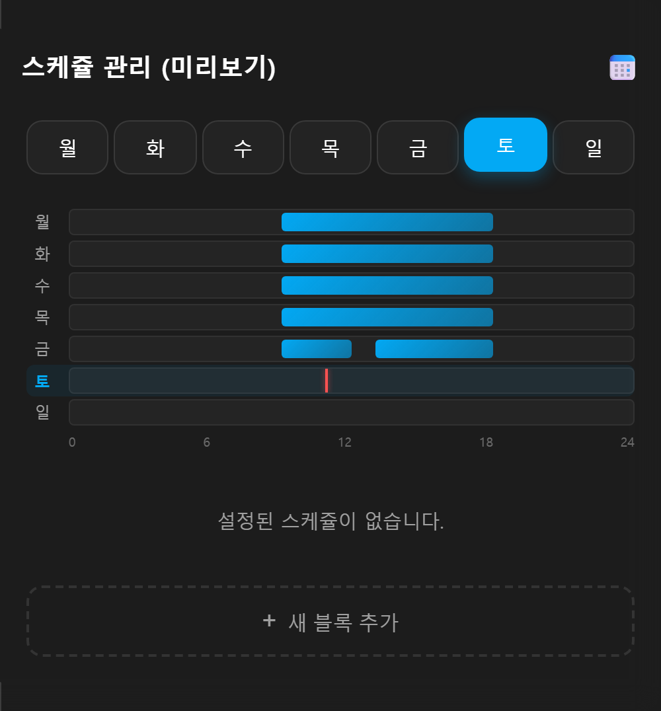
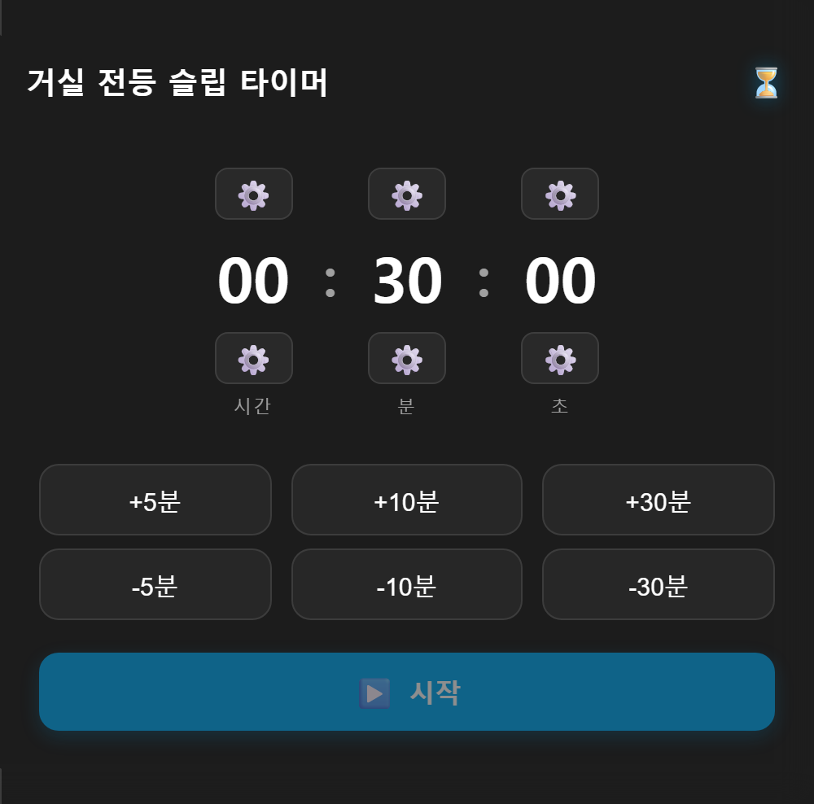

# HA Custom Schedule & Timer Cards

> Home Assistant `schedule`, `timer` 헬퍼를 시각적으로 관리하고, 헬퍼와 실제 기기를 연결하는 자동화 브릿지까지 한 번에 생성하는 Lovelace 커스텀 카드.

**Languages:** [English](README.md) · [한국어](README.ko.md)

[](https://hacs.xyz/)
[](https://github.com/jewon-oh/schedule-ui/releases)
[](#license)

단일 JS 파일로 동작하며, Home Assistant 언어 설정에 따라 한국어/영어 UI가 자동 전환됩니다.

## 스크린샷

<div align="center">
  
  
</div>

## 목차

- [주요 기능](#주요-기능)
- [설치](#설치)
- [사용 방법](#사용-방법)
- [설정](#설정)
- [동작 원리](#동작-원리)
- [개발](#개발)
- [기여](#기여)
- [라이선스](#라이선스)

## 주요 기능

- **스케쥴 자동 생성** — 카드 편집기에서 제어할 기기를 선택하면 Schedule 헬퍼와 켜짐/꺼짐 자동화가 자동으로 생성됩니다.
- **단일 파일 구조** — `timer-schedule-card.js` 한 개로 설치되며, HACS 커스텀 저장소를 지원합니다.
- **24시간 주간 타임라인** — 요일별 시간 블록을 세로 타임라인(열 = 요일, 축 = 0~24시)으로 표시하고 현재 시각선을 그립니다.
- **매일 통합 탭** — 7개 요일의 공통 시간 블록을 교집합으로 모아 한 번에 추가/삭제합니다.
- **HA Sections 레이아웃 호환** — 디스플레이 크기에 맞춰 카드 높이가 자동 조정됩니다.
- **다크/라이트 테마 대응** — 글래스모피즘 스타일로 양쪽 테마에 모두 적용됩니다.

## 설치

### HACS (권장)

1. HACS → 우측 상단 **사용자 지정 저장소(Custom repositories)** 선택
2. 저장소 URL 입력:

   ```text
   https://github.com/jewon-oh/schedule-ui
   ```

3. 목록에서 `Custom Schedule Card`를 다운로드합니다.
4. 리소스 자동 추가 팝업이 뜨면 승인합니다.

### 수동 설치

1. `timer-schedule-card.js`를 `/config/www/`에 복사합니다.
2. **설정 → 대시보드 → 리소스**에서 `/local/timer-schedule-card.js`를 `JavaScript Module` 유형으로 추가합니다.

## 사용 방법

### 1. 마법사로 자동 생성

1. 대시보드 편집 모드에서 `Custom Schedule Card` 또는 `Custom Timer Card`를 추가합니다.
2. 카드 편집기 하단의 **[ 대상 기기 선택 ]** 드롭다운을 클릭합니다.
3. 자동으로 켜고 끌 기기를 선택합니다. (종료 시 동작도 지정 가능)
4. 헬퍼와 브릿지 자동화가 즉시 생성됩니다.
5. 저장 후 뷰어 화면에서 시간 블록을 추가하면 기기가 연동됩니다.

### 2. 기존 헬퍼 직접 연결

이미 등록된 스케쥴/타이머 헬퍼가 있다면, 카드 에디터의 엔티티 선택에서 직접 지정합니다.

## 설정

```yaml
type: custom:ha-custom-schedule-card
entity: schedule.livingroom_light      # 스케쥴 엔티티 ID (필수)
title: 거실 전등 일정                  # 카드 제목 (선택)
```

| 옵션     | 필수 | 설명                                                  |
| -------- | ---- | ----------------------------------------------------- |
| `entity` | O    | 스케쥴 헬퍼 엔티티 ID. `schedule.*` 도메인만 지원.    |
| `title`  | X    | 카드 상단 제목. 미입력 시 스케쥴 기본 이름 사용.      |

### 제공 카드 종류

| 카드          | 타입                              | 설명                                       |
|---------------|-----------------------------------|--------------------------------------------|
| Schedule Card | `custom:ha-custom-schedule-card`  | 세로 24시간 주간 타임라인, 요일 통합 제어  |
| Timer Card    | `custom:ha-custom-timer-card`     | 원형 프로그레스 바, 기기 오프 타이머       |

## 동작 원리

마법사로 생성된 자동화는 `config/automation/config/{schedule_bridge_ID}`에 저장됩니다.

```text
schedule.my_device ON  → 대상 기기 turn_on
schedule.my_device OFF → 대상 기기 turn_off
```

밝기, 색상, 온도 등 추가 조건이 필요하면 **설정 → 자동화**에서 생성된 자동화를 직접 수정합니다.

## 개발

Home Assistant 서버 없이 카드 UI만 확인하려면 포함된 `preview.html`을 사용합니다.

```bash
python -m http.server 8080
# http://localhost:8080/preview.html
```

스크린샷 재생성:

```bash
npm install
node timer-screenshot.js
```

## 기여

이슈 제보와 PR은 환영합니다. 큰 변경은 사전에 이슈로 논의해주세요.

1. 저장소 Fork
2. 기능 브랜치 생성 (`git checkout -b feat/my-feature`)
3. 변경 사항 커밋
4. Push 후 Pull Request 생성

## 라이선스

이 프로젝트는 [MIT License](LICENSE) 하에 배포됩니다.
