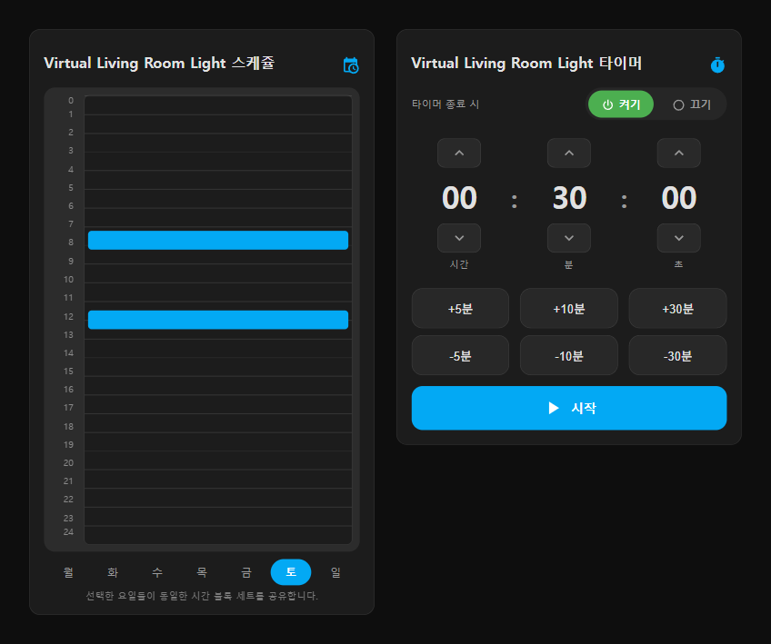

# HA Custom Schedule & Timer Cards

> Lovelace custom cards for managing Home Assistant `schedule` and `timer` helpers visually — with one-click automation bridges to wire helpers to real devices.

**Languages:** [English](README.md) · [한국어](README.ko.md)

[](https://hacs.xyz/)
[](https://github.com/jewon-oh/schedule-ui/releases)
[](https://github.com/jewon-oh/schedule-ui/actions/workflows/validate.yml)
[](#license)

Single JS file. UI auto-switches between English and Korean based on your Home Assistant language.

## Screenshots



## Table of Contents

- [Features](#features)
- [Installation](#installation)
- [Usage](#usage)
- [Configuration](#configuration)
- [How It Works](#how-it-works)
- [Development](#development)
- [Contributing](#contributing)
- [License](#license)

## Features

- **Auto-create schedules** — pick a target device in the card editor and the schedule helper plus on/off automation are generated for you.
- **Single-file delivery** — everything ships in `timer-schedule-card.js`; HACS custom repository supported.
- **24-hour weekly timeline** — vertical timeline (columns = days, axis = 0–24h) with a now-indicator line.
- **Daily merged tab** — view the intersection of blocks across all 7 days; add or delete them all at once.
- **HA Sections layout compatible** — card height auto-adjusts to your display.
- **Dark/light theme** — glassmorphism styling fits both Home Assistant themes.

## Installation

### HACS (recommended)

1. Open HACS → top-right menu → **Custom repositories**.
2. Add the repository URL:

   ```text
   https://github.com/jewon-oh/schedule-ui
   ```

3. Download `Custom Schedule Card` from the list.
4. Approve the resource auto-add prompt.

### Manual

1. Copy `timer-schedule-card.js` to `/config/www/`.
2. Add `/local/timer-schedule-card.js` as a `JavaScript Module` resource under **Settings → Dashboards → Resources**.

## Usage

### 1. Auto-create with the wizard

1. In dashboard edit mode, add `Custom Schedule Card` or `Custom Timer Card`.
2. Click the **[ Target Device ]** dropdown at the bottom of the card editor.
3. Pick the device to be turned on/off automatically (the off-action is configurable).
4. The helper and bridge automation are created immediately.
5. Save, then drag time blocks in the viewer — the device responds.

### 2. Use an existing helper

If you already have a schedule or timer helper, just select it in the card editor's entity picker.

## Configuration

```yaml
type: custom:ha-custom-schedule-card
entity: schedule.livingroom_light      # schedule entity ID (required)
title: Living Room Light               # card title (optional)
```

| Option   | Required | Description                                                         |
| -------- | -------- | ------------------------------------------------------------------- |
| `entity` | Yes      | Schedule helper entity ID. Only the `schedule.*` domain is allowed. |
| `title`  | No       | Card title. Falls back to the schedule's default name.              |

### Available cards

| Card          | Type                              | Description                                       |
|---------------|-----------------------------------|---------------------------------------------------|
| Schedule Card | `custom:ha-custom-schedule-card`  | Vertical 24h weekly timeline, daily merged tab    |
| Timer Card    | `custom:ha-custom-timer-card`     | Circular progress bar, device off-timer           |

## How It Works

Wizard-generated automations are saved under `config/automation/config/{schedule_bridge_ID}`.

```text
schedule.my_device ON  → target device turn_on
schedule.my_device OFF → target device turn_off
```

For brightness, color, temperature, or other conditions, edit the generated automation under **Settings → Automations**.

## Development

Install dependencies and build the bundle:

```bash
npm install
npm run build      # outputs timer-schedule-card.js
npm run watch      # rebuild on changes
```

Preview the card UI without a Home Assistant server using the dev HTML pages:

```bash
npm run dev        # http-server on :8080
# http://localhost:8080/dev/preview.html
# http://localhost:8080/dev/preview-timer.html
```

Run the headless smoke test (loads both previews, asserts the cards mount and emit no console errors):

```bash
npm run smoke
```

### Local Home Assistant instance (recommended for real testing)

The dev/preview HTMLs only mock a tiny slice of HA. To test the card the way HA
plugin authors usually do — against a real `schedule`/`timer` helper, the actual
`hass.callWS` API, the card picker, the visual editor, and the auto-created
automation bridge — spin up a local HA in Docker:

```bash
npm run build       # produces timer-schedule-card.js (bundled into HA via volume mount)
npm run ha:up       # docker compose up -d; HA listens on http://localhost:8123
npm run ha:logs     # tail HA logs
npm run ha:down     # stop and remove the container
```

First launch checklist:

1. Open `http://localhost:8123`, complete the onboarding wizard.
2. **Settings → Devices & services → Helpers → Create helper** → add a `Schedule` or `Timer` helper.
3. Edit any dashboard → **Add Card** → pick *Schedule Card* / *Timer Card* (no manual Lovelace resource registration needed — the bundle is auto-loaded via `frontend.extra_module_url` in [ha-config/configuration.yaml](ha-config/configuration.yaml)).
4. Rebuild (`npm run build` or `npm run watch`) and hard-refresh the browser to pick up the new bundle.

`ha-config/` is gitignored except for `configuration.yaml`, so your HA database
and credentials stay local.

Regenerate screenshots (uses Playwright + the dev preview pages):

```bash
npm run screenshot
```

Project layout:

```text
src/        TypeScript sources (built into root timer-schedule-card.js)
dev/        Browser preview HTML for offline UI testing
scripts/    Node helpers (screenshot generation)
assets/     README screenshots
examples/   YAML automation blueprints
```

## Contributing

Issues and pull requests are welcome. For larger changes, open an issue first.

1. Fork the repository
2. Create a feature branch (`git checkout -b feat/my-feature`)
3. Commit your changes
4. Push and open a Pull Request

## License

Released under the [MIT License](LICENSE).
